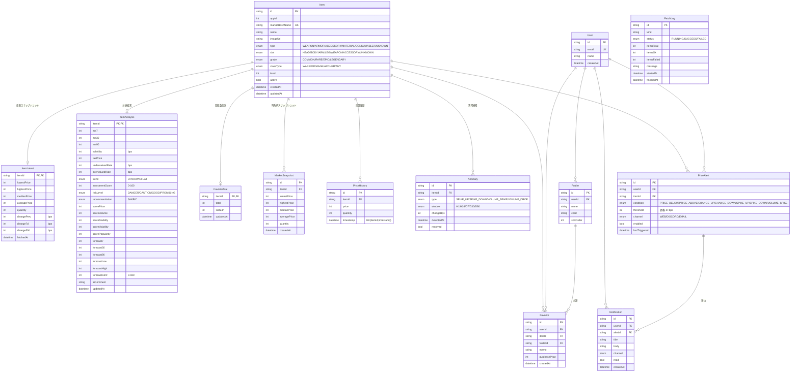

# ER図

価格は全て **最小通貨単位の整数**、変化率は **basis points (bps)** で保持する。

## 設計上のポイント

- `ItemLatest` / `ItemAnalysis` / `FavoriteStat` は `Item` と 1:1 の非正規化テーブル。
  一覧・ソート・検索を高速化するため、毎回集計せず最新値をここに持つ (一覧表示1秒以内の要件)。
- `MarketSnapshot` は15分毎の集計の時系列、`PriceHistory` は約定単位の時系列。
- 時系列クエリ向けに `(itemId, timestamp)` などの複合インデックスを付与。
- 通貨・割合の単位を整数に統一し、表示層 (`formatPrice` / `formatBps`) でのみ換算する。
